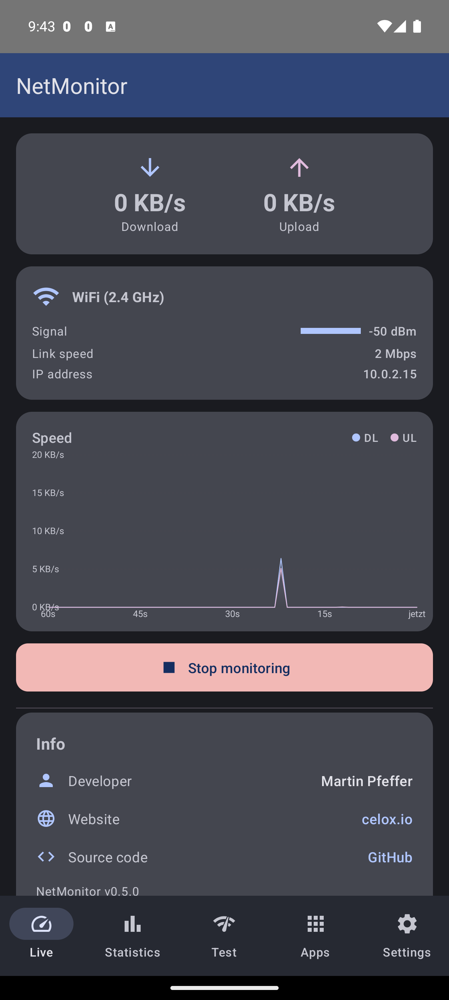
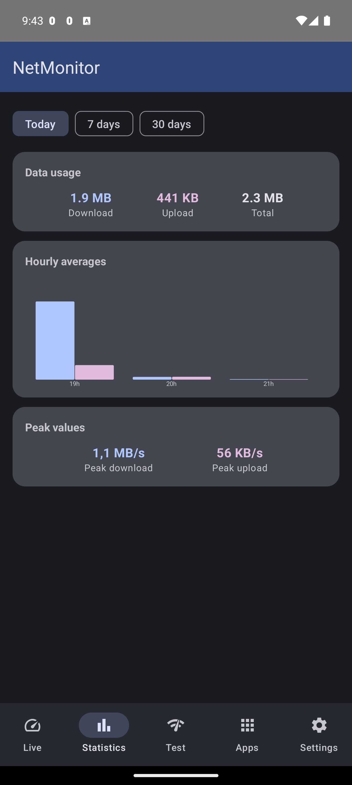
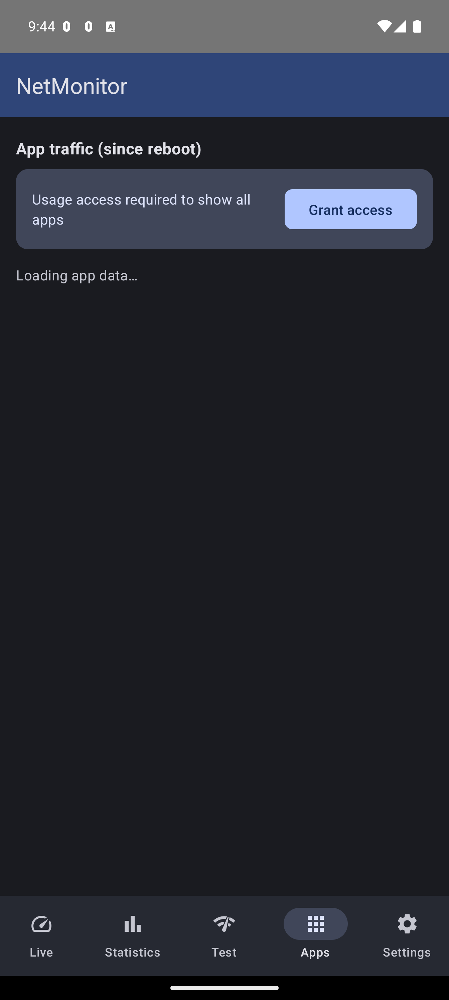
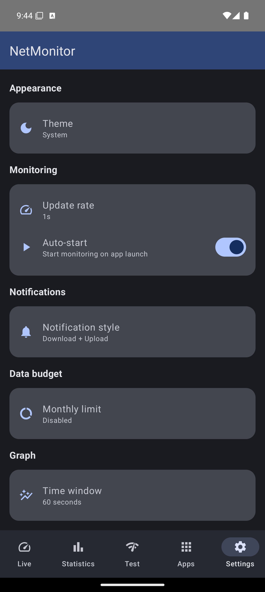

<p align="center">
  
</p>

<h1 align="center">NetMonitor</h1>

<p align="center">
  <a href="https://developer.android.com/about/versions/oreo"></a>
  <a href="https://developer.android.com/about/versions/14"></a>
  
  
  
  <a href="LICENSE"></a>
</p>

<p align="center">
  Full-featured network speed monitor for Android with live status bar indicators, traffic history, speed testing, and per-app data tracking.
</p>

---

## Features

### Live speed monitoring
Two separate notification icons display download and upload speeds directly in the Android status bar, updating every second. The format encodes the unit:
- **Whole number** (e.g. `42`) = KB/s
- **Number with comma** (e.g. `4,2`) = MB/s

### In-app dashboard (5 tabs)

| Tab | What it shows |
|-----|--------------|
| **Live** | Speed card, data budget progress, network info (WiFi/mobile details, signal strength, IP), real-time speed graph, service toggle, about section |
| **Statistics** | Daily/weekly/monthly data usage, hourly bar charts, daily stacked bar charts, peak values |
| **Speed Test** | HTTP download/upload speed test with animated gauge, latency measurement, result history |
| **Apps** | Per-app traffic breakdown sorted by total usage, with app icons and separate RX/TX counters |
| **Settings** | Theme (system/light/dark), update rate, auto-start, notification style, data budget, graph time window |

### Screenshots

<p align="center">
  
  
  
  
</p>

### Data budget
Set a monthly data limit (1-50 GB) with configurable warning threshold. A color-coded progress bar on the live screen shows usage vs. budget with warning and exceeded states.

### Quick Settings tile
Toggle monitoring on/off directly from the Android Quick Settings panel without opening the app.

### Home screen widget
Glance-based widget showing current download/upload speeds and total traffic counters.

### Traffic history
Room database stores per-second speed samples (7-day retention) and daily traffic summaries (365-day retention). Historical data powers the statistics charts and budget tracking.

### Internationalization
Full English and German translations. The app follows the device language setting.

## How it works

NetMonitor reads Android's `TrafficStats` API, which provides cumulative byte counters for all network interfaces. The `TrafficMonitor` class samples these counters once per second, computes the delta, and calculates the per-second rate using precise nanosecond timing. No root access, no VPN, no packet inspection -- just the standard system API.

The `SpeedIconRenderer` creates 96x96 pixel `ALPHA_8` bitmaps (alpha-mask format, as required by Android notification small icons) with the speed value rendered as text. A single reused `Paint` object with auto-fit sizing ensures the number fills the available space.

## Architecture

```
com.pepperonas.netmonitor/
  MainActivity.kt                -- Entry point, theme, navigation host
  NetMonitorApplication.kt       -- Application: database, repository, settings
  data/
    NetMonitorDatabase.kt         -- Room database (v2, auto-migration)
    TrafficRepository.kt          -- Data access: samples, summaries, budget
    SettingsStore.kt              -- DataStore preferences
    dao/
      SpeedSampleDao.kt           -- Per-second speed samples
      DailyTrafficDao.kt          -- Daily traffic summaries
      SpeedTestDao.kt             -- Speed test results
    entity/
      SpeedSample.kt              -- Speed measurement entity
      DailyTrafficSummary.kt      -- Daily aggregate entity
      SpeedTestResult.kt          -- Speed test result entity
  model/
    AppTrafficInfo.kt             -- Per-app traffic data class
  service/
    NetworkMonitorService.kt      -- Foreground service, dual notifications, DB persistence
    MonitorTileService.kt         -- Quick Settings tile
  ui/
    AppNavigation.kt              -- Bottom navigation (5 tabs)
    MainScreen.kt                 -- Live + Apps screens
    StatsScreen.kt                -- Historical statistics + charts
    SpeedTestScreen.kt            -- Speed test with gauge
    SettingsScreen.kt             -- All settings
    SpeedGraph.kt                 -- Canvas-based line chart
    NetworkInfoCard.kt            -- Connection details card
    DataBudgetCard.kt             -- Budget progress indicator
    MainViewModel.kt              -- Central ViewModel
    theme/                        -- Material 3 theming
  util/
    TrafficMonitor.kt             -- TrafficStats wrapper, formatting
    SpeedIconRenderer.kt          -- Notification icon bitmap renderer
    NetworkInfo.kt                -- Network details provider
    SpeedTestEngine.kt            -- HTTP speed test engine
  widget/
    SpeedWidget.kt                -- Glance home screen widget
```

### Key components

| Component | Responsibility |
|-----------|---------------|
| `TrafficMonitor` | Samples `TrafficStats` byte counters, computes bytes/sec via nanosecond deltas. `formatSpeedParts()` splits the result into value + unit for icon rendering. |
| `SpeedIconRenderer` | Kotlin `object` that creates `Bitmap.Config.ALPHA_8` icons (96x96 px). Auto-scales text size to fit. Uses `sans-serif-black` bold with `FILL_AND_STROKE` for maximum visibility. |
| `NetworkMonitorService` | Foreground service (`specialUse` type). Posts two notifications: download (ID 1, always left) and upload (ID 2, always right). 1 Hz update loop. Persists samples to Room. |
| `TrafficRepository` | Records speed samples, maintains daily summaries with peak values, provides Flow-based queries for UI, handles data cleanup (7-day detail, 365-day summary retention). |
| `SpeedTestEngine` | Measures download speed (HTTP GET from Hetzner/OVH/Tele2), upload speed (HTTP POST with server fallback), and latency (GET with Range header, multi-server). Reports real-time progress via StateFlow with error state on failure. |
| `SettingsStore` | DataStore Preferences for theme, update rate, notification style, auto-start, graph window, data budget, and warning threshold. |

## Build

```bash
./gradlew assembleDebug          # Debug APK
./gradlew installDebug           # Install on connected device via ADB
./gradlew assembleRelease        # Release APK (ProGuard enabled)
./gradlew test                   # Run unit tests
```

Requires Android SDK. Set `ANDROID_HOME` or create `local.properties` with `sdk.dir`.

## Tech stack

| Component | Version |
|-----------|---------|
| Kotlin | 1.9.22 |
| Compose BOM | 2024.01.00 |
| Material 3 | via Compose BOM |
| Room | 2.6.1 |
| DataStore | 1.0.0 |
| Navigation Compose | 2.7.6 |
| Glance (Widget) | 1.0.0 |
| Activity Compose | 1.8.2 |
| Lifecycle | 2.7.0 |
| Core KTX | 1.12.0 |
| KSP | 1.9.22-1.0.17 |
| AGP | 8.2.0 |
| Gradle | 8.2 |
| minSdk | 26 (Android 8.0) |
| targetSdk | 34 (Android 14) |

## Permissions

| Permission | Why |
|-----------|-----|
| `INTERNET` | Speed test downloads/uploads to measure connection speed |
| `ACCESS_NETWORK_STATE` | Read system traffic counters via `TrafficStats`, detect connection type |
| `FOREGROUND_SERVICE` | Keep the monitoring service running in the background |
| `FOREGROUND_SERVICE_SPECIAL_USE` | Required since Android 14 for non-standard foreground services |
| `POST_NOTIFICATIONS` | Display speed notifications (runtime permission on Android 13+) |
| `ACCESS_WIFI_STATE` | Read WiFi details (SSID, signal strength, link speed) |
| `QUERY_ALL_PACKAGES` | Resolve UIDs to app names for the per-app traffic breakdown |

## Contributing

See [CONTRIBUTING.md](CONTRIBUTING.md) for guidelines.

## Author

**Martin Pfeffer** -- [celox.io](https://celox.io) -- [GitHub](https://github.com/pepperonas)

## License

MIT -- see [LICENSE](LICENSE) for details.
